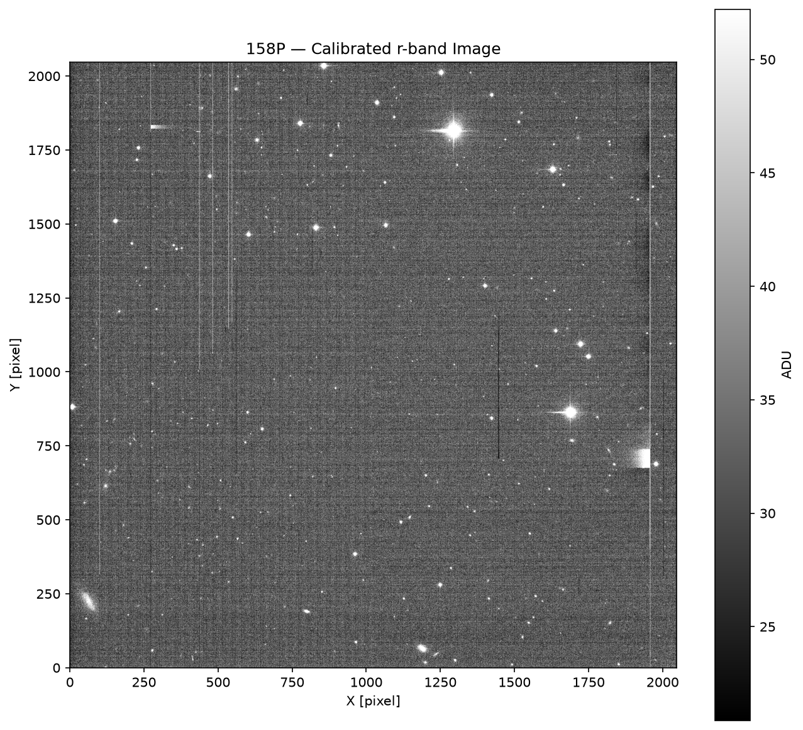
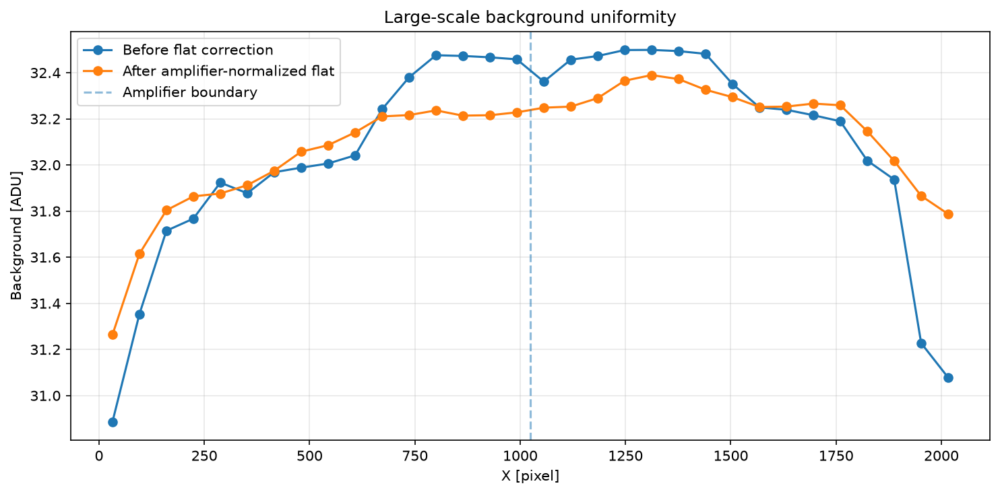

# NOIRLab CCD Data Reduction

A small CCD reduction project using archival raw observations from the **NSF NOIRLab Astro Data Archive**.

The goal is to take a raw science exposure from the CTIO 0.9 m telescope and perform a basic, transparent reduction in Python, documenting each calibration step in Jupyter notebooks.

## Dataset

- **Observatory:** Cerro Tololo Inter-American Observatory (CTIO)
- **Telescope:** CTIO 0.9 m
- **Instrument:** CFCCD / CCD Imager
- **Detector:** Tek2K_3
- **Science target:** 158P
- **Filter:** r
- **Science exposure:** 60 s
- **Calibration frames:** 10 zero/bias frames and 5 R-band dome flats

No suitable dark frames were available for the selected observing night.

## Reduction workflow

1. Inspect the raw FITS files and metadata.
2. Apply row-by-row overscan correction independently to the two CCD amplifiers.
3. Trim and reconstruct the 2048 × 2048 science region.
4. Median-combine the zero frames to create a master bias.
5. Bias-correct the R-band dome flats.
6. Normalize each CCD amplifier independently and combine the flats into a master flat.
7. Build a simple bad-pixel mask from extreme bias and flat values.
8. Calibrate the 158P science exposure.
9. Validate the large-scale background uniformity.
10. Save the final calibrated FITS image for inspection in SAOImage DS9.

## Amplifier normalization

The final amplifier median-response ratio was 0.99992. After applying
the revised flat, the large-scale background dispersion decreased from
approximately 0.55 ADU to 0.29 ADU, while the background difference
between the two amplifier regions remained close to its pre-flat value.

## Repository structure

```text
noirlab-ccd-reduction/
├── Bias/                       # Raw zero frames (not tracked by Git)
├── Flats/                      # Raw dome flats (not tracked by Git)
├── Figures/
│   ├── master_bias.png
│   ├── master_flat_r.png
│   ├── 158P_calibrated_r.png
│   └── background_uniformity.png
├── Notebooks/
│   ├── 00_data_inspection.ipynb
│   ├── 01_master_bias.ipynb
│   ├── 02_master_flat.ipynb
│   └── 03_science_reduction.ipynb
├── products/                   # Local FITS calibration products
├── .gitignore
└── README.md
```
## Final result

The final calibrated r-band science exposure is shown below.



The amplifier-normalized flat substantially improved the large-scale
background uniformity while preserving the sky level across the
two-amplifier boundary.



## Software

The notebooks use:

- Python
- NumPy
- Matplotlib
- Astropy
- Photutils
- JupyterLab

## Data availability

Raw astronomical data were obtained from the NSF NOIRLab Astro Data Archive. Raw and processed FITS files are intentionally not included in this repository.

## Notes

This is a learning-oriented reduction workflow and is not intended to reproduce the complete observatory pipeline.
